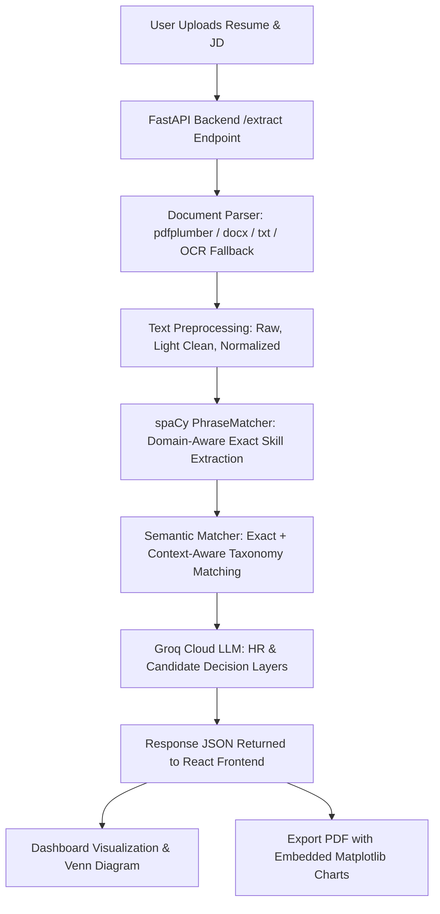

# Resume Analyzer System Architecture & Detailed Workings

This document provides a detailed breakdown of how the Resume Analyzer system processes, extracts, matches, visualizes, and reports on Resume and Job Description (JD) data.

---

## 1. System Flow Overview



---

## 2. Detailed Workings & Features

### Feature 1: Document Uploading & Parsing
- **Files Handled**: PDF, DOCX, and TXT.
- **Entrypoint**: `/extract` endpoint in [extract.py](file:///e:/1_PROJECT_INFOSYS/Resume_Analyzer/Resume_Analyzer/backend/routes/extract.py#L50-L74)
- **Parser Service**: [parser.py](file:///e:/1_PROJECT_INFOSYS/Resume_Analyzer/Resume_Analyzer/backend/services/parser.py)
- **Mechanism**:
  1. FastAPI receives documents as `UploadFile` objects.
  2. For PDFs, `pdfplumber` extracts the standard text page-by-page.
  3. **OCR Fallback**: If `pdfplumber` yields empty text (scanned PDF), the parser falls back to `pytesseract` and `pdf2image` to perform Optical Character Recognition (OCR).
  4. For DOCX, `python-docx` reads paragraphs.
  5. The raw text is returned and cleaned of excessive spacing.

### Feature 2: Skill Extraction, Previewing & Highlighting
- **Service**: [analyzer.py](file:///e:/1_PROJECT_INFOSYS/Resume_Analyzer/Resume_Analyzer/backend/services/analyzer.py)
- **Mechanism**:
  1. The preprocessor ([preprocessor.py](file:///e:/1_PROJECT_INFOSYS/Resume_Analyzer/Resume_Analyzer/backend/services/preprocessor.py)) generates a `light_clean_text` version of the input document (lowercased, collapes whitespace, and retains tech punctuation like `+`, `#`, `.`, `/`, `-`).
  2. The analyzer builds a domain-specific `spaCy` `PhraseMatcher` on top of standard taxonomy JSON files (e.g. [software.json](file:///e:/1_PROJECT_INFOSYS/Resume_Analyzer/Resume_Analyzer/backend/taxonomies/software.json)). 
  3. Standard taxonomy displays and their aliases are converted into tokenized Spacy Doc structures (`nlp.make_doc`) to enforce exact boundary matching and prevent substring bugs (like `R` matching the word `aRe`).
  4. Matching spans are filtered for overlapping boundaries (resolving long skills first).
  5. **Highlighting**: The extracted skills and their character indexes are mapped back to the UI. The frontend scans the text and wraps matching skill occurrences in highlighted HTML elements.

---

### Feature 3: Skill Matching Logic

#### Phase A: Exact Matching
Any resume skill whose canonical representation (or alias) matches a canonical JD skill is categorized as an `exact_match`. These are marked satisfied immediately.

#### Phase B: Semantic Matching (Current Taxonomy Matcher + Context Boost)
- **Service**: [taxonomy_analyzer.py](file:///e:/1_PROJECT_INFOSYS/Resume_Analyzer/Resume_Analyzer/backend/services/taxonomy_analyzer.py)
- **Mechanism**:
  1. Filter out satisfied JD skills from matching targets. We only target unsatisfied (missing) JD skills.
  2. Check if a resume skill and a JD skill share a **specialized category** (e.g., `"Frontend Development"`, `"Databases"`, etc.) in the loaded taxonomy domain.
  3. Broad generic categories (e.g. `"Programming Languages"`, `"Soft Skills"`, `"Professional Certifications"`) are explicitly ignored to prevent false matches (like Java matching Python, or Shell Scripting matching SQL).
  4. If they share a specialized category, they receive a base similarity score of `0.60 + (name_similarity * 0.40)` where `name_similarity` is calculated via `difflib.SequenceMatcher`.
  5. **Contextual Boost**: The engine extracts a surrounding text window (150 chars) around the skill's occurrences in the Resume and JD texts.
     - It extracts co-occurring taxonomy skills in both windows (`O_skills`).
     - It extracts cleaned domain-specific keywords in both windows (`O_words`).
     - It boosts the matching score by `len(O_skills) * 0.08 + len(O_words) * 0.02` (capped at `0.20` maximum).
  6. The final score determines the bucket:
     - `score >= 0.75` $\rightarrow$ **Strong Semantic Match** (e.g. React vs Angular in frontend context).
     - `0.50 <= score < 0.75` $\rightarrow$ **Moderate Semantic Match** (e.g. Flask vs Django).
     - `score < 0.50` $\rightarrow$ **Irrelevant / No Match**.

#### Historical Reference: BERT Sentence Transformer Matcher
Before being replaced due to deployment constraints (heavy CPU/memory usage, large libraries like `torch` and `sentence-transformers`, and a 120MB+ local model footprint):
1. **Embedding Generation**: The system loaded a lightweight transformer model (`all-MiniLM-L6-v2`) via `sentence-transformers`.
2. **Dense Vector Mapping**: Both JD skills and Resume skills were encoded into 384-dimensional dense floating-point vector representations.
3. **Similarity Matrix**: A cosine similarity matrix was computed between the Resume and JD skill vector sets.
4. **Synonym Detection**: Skills with a cosine similarity score above `0.72` were matched as "Strong Semantic" and between `0.55` and `0.72` as "Moderate Semantic".

#### Venn Diagram Logic
The Venn Diagram represents the overlap:
- **Left Circle**: Unique Resume Skills (Irrelevant/Extra skills not requested in the JD).
- **Intersection**: Exact Matches + Strong/Moderate Semantic Matches.
- **Right Circle**: Missing JD Skills (Skills requested but not found or semantically replaced).

---

### Feature 4: AI Analysis Playground
- **Service**: [ai_enrichment.py](file:///e:/1_PROJECT_INFOSYS/Resume_Analyzer/Resume_Analyzer/backend/services/ai_enrichment.py) & [chatbot_groq.py](file:///e:/1_PROJECT_INFOSYS/Resume_Analyzer/Resume_Analyzer/backend/services/chatbot_groq.py)
- **Decision Layers**:
  1. **HR Decision Layer**: Synthesizes match statistics, strengths, risk flags, onboarding suggestions, and final recommendation for hiring managers.
  2. **Candidate Decision Layer**: Triages missing skills, maps career progression, and provides gap closure guidance (referencing free online courses).
  3. **Evidence Layer**: Pulls exact snippets from both the JD and the Resume for matched skills to justify why the match was made.
- **Chatbot Playground**: Interactive chat interface powered by Groq cloud completions (`llama-3.1-8b-instant`) with system instructions constrained strictly to the uploaded Resume and JD context to prevent hallucination.

---

### Feature 5: Visualization & PDF Export
- **Service**: [pdf_generator.py](file:///e:/1_PROJECT_INFOSYS/Resume_Analyzer/Resume_Analyzer/backend/services/pdf_generator.py)
- **Mechanism**:
  1. **Dashboard Charts**: Rendered using React charting libraries, displaying overall match percentage, semantic grouping ledger (no duplicate cards), and match confidence distribution.
  2. **PDF Generator**: Builds a multi-page document using `fpdf2`.
  3. **Matplotlib Charts**: Generates and embeds high-resolution charts directly in the PDF byte stream (e.g. Match quality distribution bar chart).
  4. **Deduplicated Ledger**: The exported PDF shares the same grouping logic as the React frontend (merging duplicate parent skills into a single row).

---

### Feature 6: Multi-Resume Analysis
- **Entrypoint**: `/extract-multi-resume` in [extract.py](file:///e:/1_PROJECT_INFOSYS/Resume_Analyzer/Resume_Analyzer/backend/routes/extract.py#L258-L350)
- **Mechanism**:
  1. Processes a single Job Description against up to 10 resumes concurrently.
  2. Runs parsing, skill extraction, and semantic matching for each resume.
  3. **Ranking Criteria**: Candidates are sorted dynamically using a multi-key tuple:
     - Primary: `-match_percentage` (descending)
     - Secondary: `-exact_matches` (descending)
     - Tertiary: `-semantic_matches` (descending)
     - Quaternary: `missing_count` (ascending)

---

## 3. Endpoints & JSON Payloads

### POST `/extract`
Accepts `multipart/form-data` with files and fields.

#### JSON Output Format
```json
{
  "status": "success",
  "session_id": "ext_20260604_115600",
  "resume_filename": "vivek_resume.pdf",
  "jd_filename": "Manual Input",
  "resume_skills": {
    "technical_skills": ["Angular", "TypeScript", "Tailwind CSS"],
    "soft_skills": ["Communication"]
  },
  "jd_skills": {
    "technical_skills": ["React", "TypeScript", "Tailwind CSS"],
    "soft_skills": ["Communication"]
  },
  "bert_results": {
    "summary": {
      "total_jd_skills": 4,
      "resume_detected_skills": 4,
      "exact_match_count": 3,
      "semantic_match_count": 1,
      "missing_skills_count": 0,
      "overall_alignment_score": 93.5
    },
    "skill_partition": {
      "exact_match": ["TypeScript", "Tailwind CSS", "Communication"],
      "strong_semantic": [
        {
          "skill": "Angular",
          "similar_to": "React",
          "score": 0.87
        }
      ],
      "moderate_semantic": [],
      "irrelevant": []
    },
    "missing_from_resume": []
  },
  "ai_enrichment": {
    "ats_readiness": {
      "verdict": "Pass",
      "score": 94,
      "explanation": "Excellent alignment across frontend frameworks and core languages.",
      "tips": ["List specific project achievements using React metrics."]
    }
  }
}
```

### POST `/extract-multi-resume`
Accepts `multipart/form-data` containing an array of `resumes` files, one `job_description_file`, and a `domain` string.

#### JSON Output Format
```json
{
  "status": "success",
  "domain": "software",
  "jd_filename": "job_description.pdf",
  "jd_skill_count": 12,
  "resume_count": 2,
  "rankings": [
    {
      "rank": 1,
      "resume_filename": "resume_candidate_A.pdf",
      "resume_name": "resume_candidate_A",
      "match_percentage": 87.5,
      "exact_matches": 8,
      "semantic_matches": 2,
      "missing_count": 2,
      "strong_skills": ["React", "TypeScript", "SQL"],
      "missing_skills": ["Docker", "Kubernetes"],
      "resume_detected_skills": 15
    },
    {
      "rank": 2,
      "resume_filename": "resume_candidate_B.pdf",
      "resume_name": "resume_candidate_B",
      "match_percentage": 62.0,
      "exact_matches": 5,
      "semantic_matches": 1,
      "missing_count": 6,
      "strong_skills": ["Java", "SQL"],
      "missing_skills": ["React", "TypeScript", "Docker"],
      "resume_detected_skills": 10
    }
  ]
}
```
